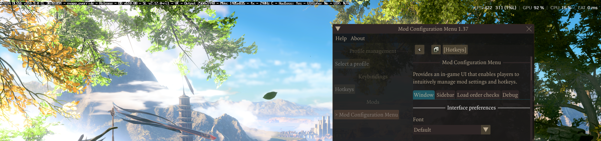

# bg3fgvk

Free, open-source **DLSS Frame Generation (x2 / x3 / x4) for Baldur's Gate 3** on Vulkan.
**Compatible with DLSS 5** (NVIDIA Neural Rendering) through OptiScaler, see
[DLSS 5](#dlss-5-neural-rendering-optional) below.

Download: [Nexus Mods](https://www.nexusmods.com/baldursgate3/mods/24804) or the
[GitHub Releases](https://github.com/thierbig/bg3fgvk/releases) page.

**Compatible with the Baldur's Gate 3 Script Extender (BG3SE) and Mod Configuration Menu (MCM).**

bg3fgvk is a small DLL that plugs NVIDIA Streamline's DLSS-G into the game's Vulkan swapchain. The
game's own DLSS Super Resolution provides depth and motion vectors; the NVIDIA driver generates and
paces the extra frames. No upscaler replacement, no menu of its own, no account or key.

Measured on an RTX 50-series card at 2560x1440 with DLSS Quality: a 30 to 35 fps scene shows at
roughly 120 to 140 fps with x4 (Streamline itself reports the multiplier).



## Quick start

1. Install [**Native Mod Loader**](https://www.nexusmods.com/baldursgate3/mods/944): extract its
   `bin` folder over the game's `bin` folder (the one with `bg3.exe`) and let it replace
   `bink2w64.dll`. It loads every DLL in `bin\NativeMods\`. Skip if you already have it.
2. Download `bg3fgvk-vX.Y.Z.zip` from the Releases page and extract its contents into that same
   `bin\` folder, merging the `NativeMods` folder. You end up with `bin\NativeMods\fgvk.dll` and
   `bin\NativeMods\Streamline\` (NVIDIA's runtime, seven files; leave the folder where it is).
3. In the game's Video settings the renderer must be **Vulkan** and **DLSS** on (any quality, or
   DLAA). Windows must have **Hardware-accelerated GPU scheduling** on.

Load a save. Frame generation starts by itself a couple of seconds into the world. Numpad `*`
turns it off and on. That is all.

## Requirements

| | |
|---|---|
| GPU | NVIDIA RTX 40 series for x2 (x3 / x4 possible, see below). RTX 50 series for x3 and x4. |
| Game | Baldur's Gate 3 in **Vulkan** mode (the default `bg3.exe`, not DirectX 11). |
| In-game | **DLSS enabled** in Video settings (any quality, or DLAA). With DLSS off the mod stays idle. |
| Loader | [Native Mod Loader](https://www.nexusmods.com/baldursgate3/mods/944) (the `bink2w64.dll` replacement). |

**RTX 40 series:** NVIDIA caps Ada at x2. The community ReShade add-on
[MFG Ada Unlock](https://github.com/mavismmg/MFGAdaUnlock-RenoDx) lifts it; then set `DLSSGFrames=3` for x4.

## Checking that it works

On first launch the mod writes `bin\NativeMods\fgvk.ini` with defaults and a log, `bin\fgvk.log`.
Frame generation turns on about two seconds after the 3D world starts rendering and suspends on
loading screens, videos and full-screen menus, where the game does not run DLSS. The log shows:

```
gate: 60 consecutive DLSS-SR frames -> DLSS-G ON
FG stats: 300 presents -> 1200 frames displayed (x4.00) status=0
```

`x4.00` is Streamline's own count of displayed frames per rendered frame. The game's FPS display
cannot see generated frames; use the NVIDIA App or Steam overlay. `x1.00` while playing: see
Troubleshooting.

## Hotkeys

| Key | Action |
|---|---|
| Numpad `*` | Frame generation on / off |
| `End` | Cycle x2, x3, x4 |

If the NVIDIA App has a per-game *DLSS Override, Frame Generation* setting for Baldur's Gate 3
(for example "4x"), it pins the multiplier and `End` appears to do nothing. Set it to "Use 3D
application setting" to let the mod decide. It works either way.

Advanced settings (multiplier, Reflex mode, hotkeys) live in `bin\NativeMods\fgvk.ini`, written
with defaults on first launch and documented in [BUILD.md](BUILD.md).

## What to expect

- The displayed frame rate is roughly 4x, 3x or 2x the rendered one.
- A little more input latency than without frame generation; Reflex Boost keeps it in check.
  30 fps rendered or more is where x4 looks good; below that, x2 or x3 is the better trade.
- It pauses when the window loses focus, on loading screens and in videos, and resumes by itself.
- Very fast camera pans can show light smearing. That is the technique, not a bug.

## DLSS 5 Neural Rendering (optional)

bg3fgvk runs together with DLSS 5 through the
[OptiScaler_DLSSNR](https://github.com/Dagherbou/OptiScaler_DLSSNR) fork of OptiScaler. OptiScaler
passes the game's DLSS call through to the driver and runs the Neural Rendering model over the
upscaled image; bg3fgvk reads that same call, so the generated frames carry the result. RTX 50
series only, and you must supply NVIDIA's `nvngx_dlssnr.dll` yourself (the RenoDX Discord distributes
it with its DLSS 5 add-on). Setup and the ini keys that matter are in **[docs/DLSS5.md](docs/DLSS5.md)**.


## Troubleshooting

Diagnostics are `bin\fgvk.log` (this mod) and `bin\sl.log` (Streamline).

- **`FG stats` shows `x1.00` while playing.** No `gate: ... DLSS-G ON` line means the game is not
  running DLSS: enable it in Video settings. BG3 silently drops the DLSS setting after a failed
  init, so re-select it. `status=2` means Reflex is off (`ReflexMode` in `fgvk.ini` must be 1 or 2); `status=1` means
  the resolution is too low. The window must have focus.
- **The game does not start, or the log stops after `slInit`.** Streamline files missing from
  `bin\NativeMods\Streamline\` or mixed from two versions, or Hardware-accelerated GPU scheduling
  is off.
- **Black screen or freeze.** Another mod that hooks Vulkan (an overlay, another frame generator)
  is the usual cause; `sl.log` shows `WaitSemaphores ... timed out` right before the stall.
  OptiScaler's menu with frame generation on froze the game in bg3fgvk 0.1.0; 1.0.0 fixes it.
  Attach both logs to a report.
- **Script Extender mods stop drawing their UI.** Not expected; report it with the logs.

Developers: build steps, how it works, the Streamline runtime files and the stack dumper are in
[BUILD.md](BUILD.md).

## Credits and licenses

- bg3fgvk is released under the MIT License (see `LICENSE`).
- The NVIDIA Streamline SDK 2.12.0 runtime (`sl.*.dll`, `nvngx_dlssg.dll`, `NvLowLatencyVk.dll`)
  is bundled unmodified from NVIDIA's release package under its license, included as
  `STREAMLINE-LICENSE.txt`. Copyright NVIDIA Corporation.
- Microsoft Detours (MIT) for the hooks.
- Norbyte's Baldur's Gate 3 Script Extender, which this mod is built to coexist with.
- PureDark's frame generation mod for Baldur's Gate 3, whose DLSS-G input recipe served as the
  reference for what the game's buffers look like.
- Dagherbou's OptiScaler_DLSSNR fork, which makes the optional DLSS 5 setup possible.
- !FingerPaint, who found that the OptiScaler_DLSSNR fork and bg3fgvk work together and reported
  the combination.
