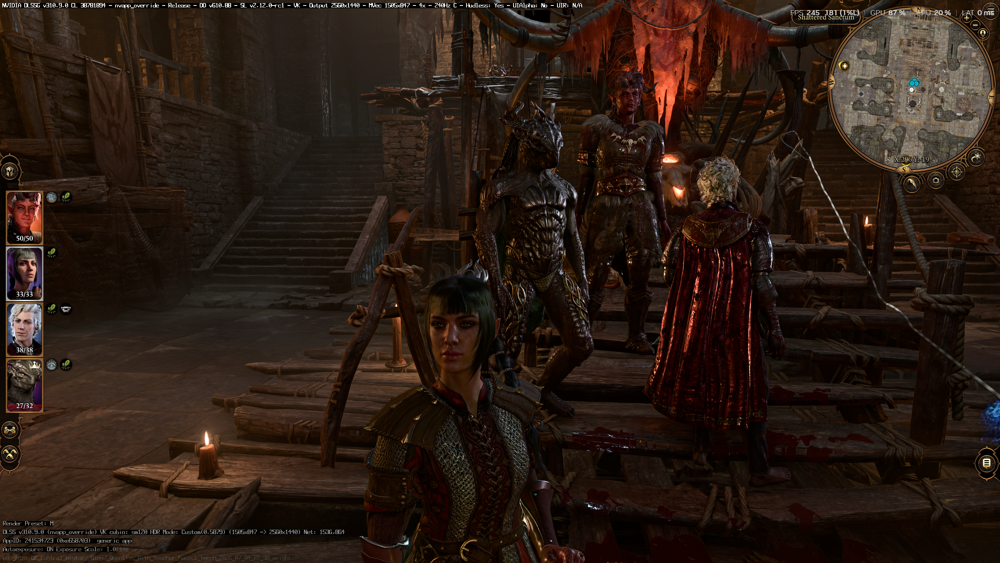
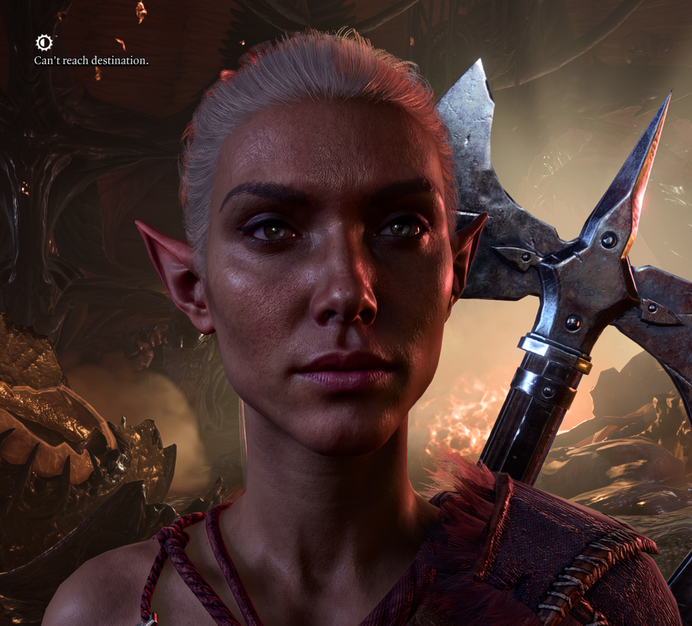
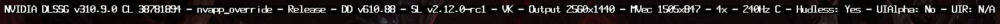
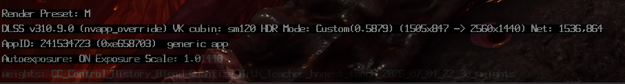

# DLSS 5 Neural Rendering alongside bg3fgvk

Optional guide for the [bg3fgvk](../README.md) frame generation mod. The combination was found and
reported by **!FingerPaint**; thanks.

bg3fgvk works together with **DLSS 5**, NVIDIA's Neural Rendering pass, through the
[OptiScaler_DLSSNR](https://github.com/Dagherbou/OptiScaler_DLSSNR) fork of OptiScaler by Dagherbou.
Both run at once: OptiScaler passes the game's DLSS Super Resolution call through to the driver and
runs the Neural Rendering model over the upscaled image in place, and bg3fgvk reads that same call for
frame generation. The generated frames carry the Neural Rendering result too.

Verified on 2026-09-04 with an RTX 5070 Ti, driver 610.88, 2560x1440, DLSS-G x4. NVIDIA's own
on-screen indicators (a registry switch, off by default) show all three features live:

None of this is supported by NVIDIA. The fork drives an undocumented model and is under active
development; check its release notes.

### Requirements

- An **RTX 50 series** card. The Neural Rendering model does not run on older GPUs.
- `nvngx_dlssnr.dll`, NVIDIA's model DLL (about 165 MB, "NVIDIA DLSSNR" in its file properties).
  It comes from an NVIDIA driver package. Neither the fork nor bg3fgvk ships it.
- The fork's notes ask for driver 616.56 or newer. The stock 310.8.0 model also ran here on 610.88.
- bg3fgvk installed and working first (`x4.00` in `fgvk.log`).

### Install

1. Download `OptiScaler-DLSSNR-vX.Y.Z.zip` from the fork's
   [Releases](https://github.com/Dagherbou/OptiScaler_DLSSNR/releases) page and extract everything
   into the game's `bin\` folder, next to `bg3.exe`: the `OptiScaler\` folder, `Licenses\`,
   `nvngx.dll_dlssnr.dll`, `OptiScaler.dll` and `OptiScaler.ini`.
2. Rename `OptiScaler.dll` to **`dxgi.dll`** (or run `setup_windows.bat` and pick option 1).
   The script suggests `winmm.dll` for Vulkan games, but `bg3.exe` does not import winmm; it does
   import dxgi, so that one loads reliably.
3. Put `nvngx_dlssnr.dll` into `bin\` as well.
4. Edit `bin\OptiScaler.ini`:

| Section | Key | Set to | Why |
|---|---|---|---|
| `[Upscalers]` | `VulkanUpscaler` | `dlss` | **Required.** OptiScaler's default for Vulkan games is FSR 2.2, which silently replaces the game's DLSS. Frame generation would still run, on FSR. |
| `[DlssNr]` | `Enabled` | `true` | Turns Neural Rendering on without opening the menu. |
| `[Spoofing]` | `StreamlineSpoofing` | `false` | Otherwise Streamline can be shown a spoofed RTX 4090 and cap frame generation at x2. |
| `[Spoofing]` | `Dxgi` | `false` | No spoofing on an NVIDIA GPU. |
| `[Menu]` | `OverlayMenu` | your choice | With bg3fgvk 1.0.0 or newer the OptiScaler menu (`Insert`) works with frame generation on. On bg3fgvk 0.1.0 it froze the game; set `false` there. |

5. Launch the game and load a save. `bin\OptiScaler.log` (file logging is on in the fork's ini)
   shows `DLSS-NR Vulkan: the model initialised on this device`. `bin\fgvk.log` still shows
   `gate: ... DLSS-G ON` and `x4.00`. Its hook line now reads `NGX hooks: module=_nvngx.dll`, which
   is expected: bg3fgvk hooks the driver's NGX core that OptiScaler loads.

### Cost

The model runs at output resolution on every rendered frame. At 2560x1440 on an RTX 5070 Ti it
roughly halved the rendered frame rate; with x4 frame generation the displayed rate stays high.
`WorkingScale` under `[DlssNr]` (for example `0.75`) runs the model smaller to win some of that
back. The fork's ini and readme document the other knobs.

### The OptiScaler menu and bg3fgvk 0.1.0

With bg3fgvk 0.1.0, opening the OptiScaler menu while frame generation was on froze the game: the
overlay had hooked the driver's present call underneath Streamline and injected GPU work and fence
waits on Streamline's frame-pacing thread. bg3fgvk 1.0.0 routes such hooks above frame generation,
on the game thread, so the menu now draws normally with x4 running. If you are still on 0.1.0, keep
`OverlayMenu=false` or suspend frame generation with Numpad `*` before pressing `Insert`.

### Removing it

Delete `dxgi.dll`, `OptiScaler.ini`, `OptiScaler.log`, `nvngx.dll_dlssnr.dll`, `nvngx_dlssnr.dll`
and the `OptiScaler\` and `Licenses\` folders from `bin\`. bg3fgvk itself is untouched.
