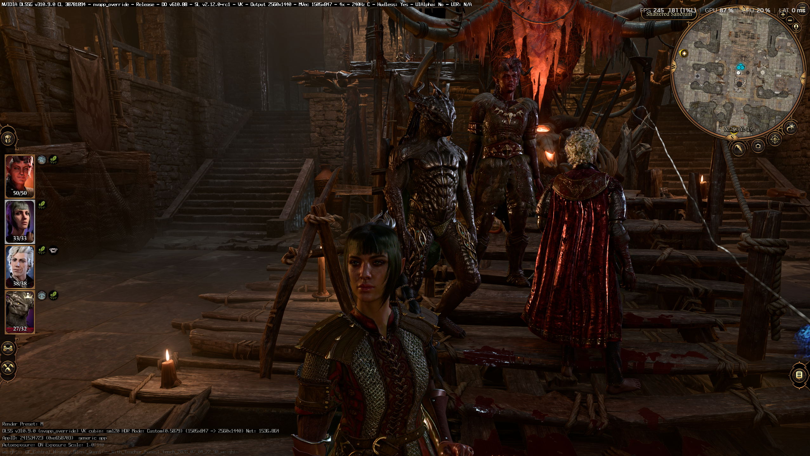
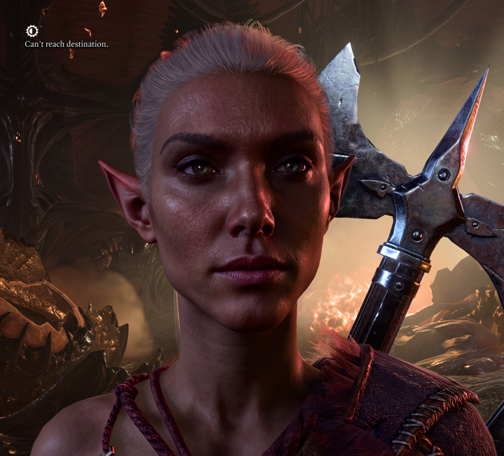
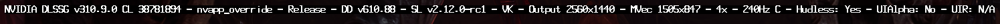
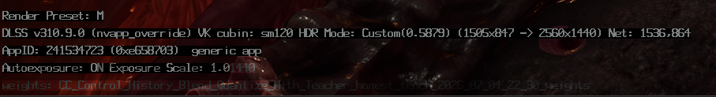

# DLSS 5 Neural Rendering alongside bg3fgvk

Optional guide for the [bg3fgvk](../README.md) frame generation mod. The combination was found and
reported by **!FingerPaint**; thanks.

bg3fgvk works together with **DLSS 5**, NVIDIA's Neural Rendering pass, through OptiScaler. The
recommended build is **janblade's
[OptiScaler-F5-DLSSNR-Multipass](https://github.com/janblade/OptiScaler-F5-DLSSNR-Multipass)**, a
fork of wilsjo2's pre-upscale fork, which is itself a fork of Dagherbou's original OptiScaler_DLSSNR.
It runs the Neural Rendering model on the game's render-resolution image just before DLSS Super
Resolution upscales it, and bg3fgvk reads that same DLSS call for frame generation. The generated
frames therefore carry the Neural Rendering result too.





**Tested:** janblade v0.1.24 with bg3fgvk, on an RTX 5070 Ti with driver 616.92, 2560x1440 output,
DLSS rendering at 1969x1107, frame generation x4, on 2026-09-30. NVIDIA's own on-screen indicators
(a registry switch, off by default) show all three features live:




None of this is supported by NVIDIA. The fork drives an undocumented model and changes almost
daily; check its release notes.

### Why this build

- **The model runs before upscaling, on native Vulkan.** It works at your DLSS render resolution
  instead of the full output resolution, so it processes fewer pixels, and DLSS then stabilises the
  enhanced image over time.
- **Your settings reach the model on Vulkan.** Since v0.1.23 the strength sliders and the
  motion-vector scale are passed to the model on the Vulkan path; earlier builds of this line
  dropped them silently.
- **It is actively maintained**, and its author tests on an RTX 5070 Ti.

### Requirements

- An **RTX 50 series** card, which is what was tested. The fork's own guide covers RTX 20, 30 and
  40 through ShortFuse's cross-generation runtime instead of NVIDIA's original model DLL; that route
  has not been tested with bg3fgvk.
- NVIDIA driver **616.56 or newer**. An older driver cannot create the model.
- `nvngx_dlssnr.dll`, NVIDIA's model DLL: about 165 MB, version 310.8.0, "NVIDIA DLSSNR" in its
  file properties. Neither the fork nor bg3fgvk ships it. **Where to get it:** the
  [RenoDX](https://github.com/clshortfuse/renodx) Discord, which distributes it with its DLSS 5
  add-on. The RTX 50 copy used here is the original NVIDIA-signed file with SHA-256
  `E16BCF15E16E13F527491CDF7845B2FE6521A738D8F7C9C721866A8496E1FC8E`. A 165 MB file named
  `nvngx_dlssd.dll` is this model misnamed, not Ray Reconstruction.
- bg3fgvk 1.0.0 or newer, installed and working first (`x4.00` in `fgvk.log`).

### Install

1. From the fork's [Releases](https://github.com/janblade/OptiScaler-F5-DLSSNR-Multipass/releases)
   page, download the `OptiScaler-DLSSNR-F5-...zip` release asset, not GitHub's source-code zip.
   Extract everything into the game's `bin\` folder, next to `bg3.exe`.
2. Rename `OptiScaler.dll` to **`dxgi.dll`**, or run `setup_windows.bat` and pick `dxgi.dll`.
   Do not use `winmm.dll` for this game: `bg3.exe` does not import it, but it does import dxgi.
3. Put NVIDIA's `nvngx_dlssnr.dll` into `bin\` too. Leave the package's own `nvngx.dll_dlssnr.dll`
   where it is. The two names differ by one character and both are needed.
4. Ignore the `Optional\` folder. It holds a DirectML backend for AMD and Intel cards.
5. Edit `bin\OptiScaler.ini`. The keys are in different sections, so search for each one:

| Section | Key | Set to | Why |
|---|---|---|---|
| `[Upscalers]` | `VulkanUpscaler` | `dlss` | **Required.** OptiScaler's default for Vulkan games is FSR 2.2, which silently replaces the game's DLSS. Frame generation would still run, on FSR. |
| `[DlssNr]` | `Enabled` | `true` | Turns Neural Rendering on. On native Vulkan it has to be set before launch. |
| `[DlssNr]` | `RunBeforeSR` | `true` | Runs the model at render resolution, before DLSS upscales. |
| `[DlssNr]` | `FinishedPicture` | `false` | **Must stay off with bg3fgvk.** bg3fgvk hands frame generation the image straight out of DLSS, so an edit applied after that would be missing from the generated frames. |
| `[DlssNr]` | `DeferredDLSS` | `false` | Direct3D 12 only. |
| `[DlssNr]` | `Passes` | `1` | Each extra pass costs roughly another model run. |
| `[Spoofing]` | `StreamlineSpoofing` | `false` | Otherwise Streamline can be shown a spoofed RTX 4090 and cap frame generation at x2. |
| `[Spoofing]` | `Dxgi` | `false` | No spoofing on an NVIDIA GPU. |

6. **In the NVIDIA App**, open Graphics, then Program Settings, then Baldur's Gate 3, and set
   **DLSS Override - Frame Generation Mode** to **Use 3D app setting**. It is often set globally,
   for example to "Multiplier: 4x", and then the driver loads its own newer Streamline plugins in
   place of the ones bg3fgvk ships. This OptiScaler build crashes a few seconds after launch on
   those plugins. Turning the override off also lets bg3fgvk and its `End` key set the multiplier.
7. Launch the game and load a save. The logs in `bin\` should show, with your own render
   resolution:

```
OptiScaler.log   DLSS-NR Vulkan: the model initialised on this device
OptiScaler.log   DLSS-NR Vulkan: running before SR at 1969x1107, guides 1969x1107
fgvk.log         FG stats: 300 presents -> 1200 frames displayed (x4.00) status=0
```

### In the OptiScaler menu

`Insert` opens the menu. With bg3fgvk 1.0.0 or newer it works while frame generation is running.

- **Reuse detail between frames** stays unavailable here. It needs the model placed after upscaling
  and switches itself off under frame generation. Leave it off.
- **Reuse bottleneck** does nothing on Vulkan. The log states "Reuse bottleneck stays off on
  Vulkan".
- **Automatic exposure** is the default brightness handling. **Tune for this scene** searches for
  the model input brightness that adds the most detail with the least flicker.
- The **ms elapsed** reading includes GPU time shared with other work, so it overstates the cost.
  To measure the real cost, compare your frame rate with **Apply the model** on and off.
- **Model resolution** below 100% makes the model cheaper. The frame itself stays at full
  resolution; only the model's own work gets smaller.

### Troubleshooting

- **The game crashes a few seconds after launch:** the NVIDIA App's frame generation override, see
  step 6.
- **`x1.00` in `fgvk.log` while you are in another window:** frame generation pauses whenever the
  game loses focus and resumes when you come back.
- **Neural Rendering does nothing:** look for the two OptiScaler lines from step 7. Check that
  `Enabled=true` was in the ini before launch and that the driver is 616.56 or newer.

### Other builds that work

- **wilsjo2's [OptiScaler-DLSSNR-PreSR-Multipass](https://github.com/wilsjo2/OptiScaler-DLSSNR-PreSR-Multipass)**,
  janblade's upstream, also runs before upscaling on native Vulkan with bg3fgvk (tested with
  v0.8.7). It has no helper DLL and needs driver 616.56 or newer.
- **Dagherbou's [OptiScaler_DLSSNR](https://github.com/Dagherbou/OptiScaler_DLSSNR) v0.2.0**, the
  original and the most downloaded. It runs the model after upscaling at full output resolution,
  which costs more. Tested with bg3fgvk on 2026-09-04.
- Setups through ReShade and the RenoDX DLSS 5 add-on do not coexist with bg3fgvk's frame
  generation.

### Removing it

From `bin\`, delete `dxgi.dll`, `OptiScaler.ini`, `OptiScaler.log`, `nvngx.dll_dlssnr.dll`,
`nvngx_dlssnr.dll`, the `OptiScaler\`, `Licenses\`, `docs\` and `redist\` folders, and the fork's
`.md`, `setup_*` and `get_streamline.ps1` files. bg3fgvk itself, in `bin\NativeMods\`, is untouched.
